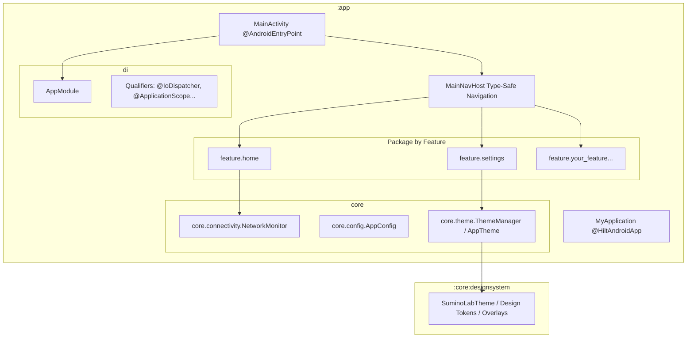

# SuminoLab Architecture & Engineering Blueprint

Welcome to the **SuminoLab** architectural documentation. This project is a universal, production-ready Android template and platform engineered for **Sumino Apps** by Rohitraj Khorwal.

---

## 1. Architectural Overview

SuminoLab employs a pragmatic **Hybrid Modular Architecture**:
1. **Shared Platform Modules (`:core:designsystem`):** Standalone library modules designed for cross-app reuse via Gradle composite builds (`includeBuild`).
2. **Feature-Oriented Application (`:app`):** High cohesion, low coupling, single-module architecture organized strictly by **Package-by-Feature**.



---

## 2. Project Directory Structure

```
SuminoLab/
├── gradle/
│   └── libs.versions.toml             # Universal Version Catalog (AGP 9.3, Kotlin 2.4, Hilt 2.60, Compose BOM)
├── build.gradle.kts                   # Root build script with centralized subprojects configuration
├── settings.gradle.kts                # Module declarations (:app, :core:designsystem)
├── gradle.properties                  # Optimized daemon memory (4GB), parallel execution & cache flags
│
├── core/
│   └── designsystem/                  # [Multi-Module] Shared M3 Design Tokens & Debug Overlays
│       ├── theme/                     # SuminoLabTheme, LightColor, DarkColor, Spacing, Dimens, Motion
│       └── guidelines/                # GridLines, CenterLines, DebugBounds, SafeAreaOverlay, DesignOverlay
│
└── app/src/main/java/com/sumino/
    ├── MyApplication.kt               # @HiltAndroidApp, Timber logging setup, Theme init
    │
    ├── core/                          # Universal app-level core utilities
    │   ├── common/                    # Universal Outcome monad (Success, Error, Loading)
    │   ├── config/                    # AppConfig (decoupled BuildConfig wrapper)
    │   ├── connectivity/              # NetworkMonitor (OEM cold-start resilient Flow<Boolean>)
    │   └── theme/                     # AppTheme composable & ThemeManager (in-memory flicker-free state)
    │
    ├── data/                          # Data Layer (Local storage, Database, Network, Mappers)
    │   ├── local/
    │   │   ├── prefs/                 # PrefKeys & SharedPref (Synchronous SharedPreferences + Gson)
    │   │   ├── datastore/             # DataStorePrefs, Serializer & ProtoDataStorePrefs (Asynchronous Flow)
    │   │   └── database/              # Room Database, Converters, DAOs (AppDao), and Entities (AppEntity)
    │   ├── mapper/                    # Data <-> Domain Mappers (AppMappers)
    │   └── repository/                # Repository Implementations (AppRepositoryImpl)
    │
    ├── domain/                        # Domain Layer (Pure Kotlin, Business Logic, no Android UI)
    │   ├── model/                     # @Immutable Domain Models (AppModel)
    │   ├── repository/                # Repository Interfaces / Contracts (AppRepository)
    │   └── usecase/                   # Single-purpose UseCases (GetAppConfigUseCase, ClipboardHelper)
    │
    ├── di/                            # Dependency Injection with Hilt
    │   ├── AppModule.kt               # System services, Context, Coroutine dispatchers, Gson
    │   ├── Qualifiers.kt              # @ApplicationScope, @IoDispatcher, @DefaultDispatcher, @MainDispatcher
    │   ├── SharedPrefModule.kt        # Provides SharedPreferences & SharedPref
    │   ├── DatabaseModule.kt          # Provides Room AppDatabase & DAOs
    │   └── BindsModule.kt             # @Binds repository implementations to domain interfaces
    │
    ├── feature/                       # ✨ PACKAGE BY FEATURE (Feature Modules)
    │   ├── home/
    │   │   ├── navigation/            # Type-safe @Serializable HomeRoute & NavGraph extensions
    │   │   ├── state/                 # @Immutable HomeUiState
    │   │   ├── HomeRoute.kt           # Stateful Route (ViewModel + State hoisting)
    │   │   ├── HomeScreen.kt          # Pure Stateless UI with @Preview
    │   │   └── HomeViewModel.kt       # @HiltViewModel with NetworkMonitor observation
    │   │
    │   └── settings/
    │       ├── navigation/            # Type-safe @Serializable SettingsRoute & NavGraph extensions
    │       ├── state/                 # @Immutable SettingsUiState
    │       ├── SettingsRoute.kt       # Stateful Route
    │       ├── SettingsScreen.kt      # Real-time ThemeMode switcher + App Info (uses AppTopBar)
    │       └── SettingsViewModel.kt   # Updates ThemeManager reactively across the whole app
    │
    └── ui/                            # Shared UI Building Blocks & Navigation
        ├── activity/main/             # MainActivity.kt & MainNavHost.kt (Type-safe NavHost with auto system bar theming)
        ├── dialog/                    # Reusable dialogs (CenterAlertDialog)
        ├── sheet/                     # Reusable bottom sheets (AppBottomSheet, BottomSheetController)
        ├── shared/                    # Reusable widgets (AppTopBar, NetworkSnackbar)
        └── utils/                     # Compose & UI Utilities (ModifierExt, UiExtensions)
```

---

## 3. Core Architecture Standards

### A. The 5-Part Feature Contract
Every screen inside `feature/` must be decoupled into five distinct files:
1. **`navigation/<Name>Navigation.kt`**:
   - `@Serializable object <Name>Route`
   - `fun NavGraphBuilder.<name>Screen(...)`
   - `fun NavController.navigateTo<Name>(...)`
2. **`state/<Name>UiState.kt`**:
   - Immutable data class (`@Immutable data class <Name>UiState(...)`).
3. **`<Name>ViewModel.kt`**:
   - Annotated with `@HiltViewModel`.
   - Exposes read-only `StateFlow<<Name>UiState>` via `.asStateFlow()`.
4. **`<Name>Route.kt`**:
   - Stateful Composable that injects the ViewModel via `hiltViewModel()`.
   - Collects state lifecycle-safely using `collectAsStateWithLifecycle()`.
   - Delegates rendering and passes lambda callbacks to `<Name>Screen`.
5. **`<Name>Screen.kt`**:
   - Pure stateless composable accepting UI state and emitting event lambdas.
   - Zero ViewModel or NavController references.
   - Accompanied by a `@Preview` composable using `AppTheme`.

### B. Dependency Injection Guidelines
- Always inject Dispatchers using qualifiers:
  ```kotlin
  @Inject constructor(
      @IoDispatcher private val ioDispatcher: CoroutineDispatcher
  )
  ```
- Long-running background jobs tied to the application lifecycle use:
  ```kotlin
  @Inject constructor(
      @ApplicationScope private val appScope: CoroutineScope
  )
  ```

### C. Real-Time Connectivity Monitoring
Use `NetworkMonitor` anywhere you need to check or react to internet availability:
```kotlin
@Inject lateinit var networkMonitor: NetworkMonitor

// In Compose:
val isOnline by networkMonitor.isOnline.collectAsStateWithLifecycle(initialValue = true)

// Synchronous check:
val connected = networkMonitor.isConnected()

// Wi-Fi check:
val onWifi = networkMonitor.isWifi()
```

### D. Zero-Flicker Dynamic Theming
Theme changes are handled without cold-start flicker:
- Initialized synchronously in `MyApplication.onCreate()` via `ThemeManager.init(...)`.
- `AppTheme` reacts instantly to any call to `ThemeManager.setThemeMode(mode)` without restarting the Activity.

---

## 4. Comprehensive Package & Layer Blueprint

This project defines a permanent standard for where every class and file belongs:

### 1. Data Layer (`com.sumino.data`)
Owns local persistence, network endpoints, data sources, and mappers.
- **`data/local/prefs/`**:
  - `PrefKeys.kt`: Single-source-of-truth constants for key strings.
  - `SharedPref.kt`: Synchronous key-value access backed by Android `SharedPreferences`. Best for startup flags (`isFirstTimeLaunch`, `themeMode`, privacy consent) and quick Gson caching.
- **`data/local/datastore/`**:
  - `model/DataStorePrefs.kt`: Immutable `@Serializable data class` representing user settings.
  - `DataStorePrefsSerializer.kt`: Fault-tolerant JSON serializer with fallback to defaults.
  - `ProtoDataStorePrefs.kt`: Reactive preferences stream (`preferencesFlow: Flow<DataStorePrefs>`) with atomic `updatePreference { ... }`.
- **`data/local/database/`**:
  - `AppDatabase.kt`: Room database definition (`version = 1`, `exportSchema = false`). Provided via `DatabaseModule`.
  - `Converters.kt`: `@TypeConverter` methods for dates, enums, and JSON lists.
  - `dao/`: Room Data Access Objects (e.g. `AppDao.kt`) exposing reactive `Flow` for reads and `suspend` methods for writes.
  - `entity/`: Room `@Entity` tables (e.g. `AppEntity.kt`).
- **`data/mapper/`**:
  - `AppMappers.kt`: Clean mapping functions (`toDomain()` and `toEntity()`) keeping database models decoupled from domain models.
- **`data/repository/`**:
  - `AppRepositoryImpl.kt`: Implements domain repository interfaces, coordinating Database, DataStore, and SharedPreferences on the injected `@IoDispatcher`.

### 2. Domain Layer (`com.sumino.domain`)
The core business logic layer. Completely decoupled from Android framework UI, Room annotations, or network libraries.
- **`domain/model/`**:
  - `AppModel.kt`: Pure `@Immutable` Kotlin data models consumed by ViewModels and Composables.
- **`domain/repository/`**:
  - `AppRepository.kt`: Clean interfaces declaring data operations without revealing storage details.
- **`domain/usecase/`**:
  - `GetAppConfigUseCase.kt`: Single-purpose executable operations encapsulating domain logic.
  - `ClipboardHelper.kt`: Universal text copy/read helper with system clipboard integration.

### 3. Dependency Injection Layer (`com.sumino.di`)
All Hilt dependency definitions:
- `AppModule.kt`: Context, System Services, Coroutine Dispatchers, and Gson.
- `Qualifiers.kt`: Scope & Dispatcher qualifiers (`@IoDispatcher`, `@DefaultDispatcher`, `@MainDispatcher`, `@ApplicationScope`).
- `SharedPrefModule.kt`: Provides `SharedPreferences` and `SharedPref`.
- `DatabaseModule.kt`: Builds and provides `AppDatabase` and its DAOs.
- `BindsModule.kt`: Abstract module binding repository implementations to their domain interfaces.

### 4. Common Result Pattern (`com.sumino.core.common`)
- `Outcome.kt`: Universal sealed interface representing `Success<T>`, `Error`, and `Loading`. Includes functional operators (`map`, `onSuccess`, `onError`, `getOrNull`).

### 5. UI Foundation Layer (`com.sumino.ui`)
Reusable Material 3 building blocks shared by all feature screens:
- **`ui/shared/`**:
  - `AppTopBar.kt`: Production top toolbar with optional title, back button, trailing actions, and scroll behavior.
  - `NetworkSnackbar.kt`: Animated banner confirming online/offline status changes.
- **`ui/dialog/`**:
  - `CenterAlertDialog.kt`: Centered M3 dialog with icon header, title, body, and customizable confirm/dismiss actions.
- **`ui/sheet/`**:
  - `AppBottomSheet.kt`: Reusable bottom sheet with `SheetConfig`, `BottomSheetController`, `rememberAppBottomSheet()`, and `AppBottomSheetHost`.
- **`ui/utils/`**:
  - `ModifierExt.kt`: Compose modifiers (`noRippleClickable`, `debounceClickable`, `shimmerLoading`).
  - `UiExtensions.kt`: Convenient helpers for Context, Activity resolution, Toast, URL launching, and sharing.

---

## 5. How to Create a New Feature

Follow this step-by-step example to add a new feature (e.g. `feature/profile`):

1. **Create Directory:** `app/src/main/java/com/sumino/feature/profile/`
2. **Define Route in `navigation/ProfileNavigation.kt`:**
   ```kotlin
   @Serializable object ProfileRoute

   fun NavGraphBuilder.profileScreen(onNavigateBack: () -> Unit) {
       composable<ProfileRoute> {
           ProfileRoute(onNavigateBack = onNavigateBack)
       }
   }

   fun NavController.navigateToProfile(navOptions: NavOptions? = null) {
       navigate(ProfileRoute, navOptions)
   }
   ```
3. **Define State in `state/ProfileUiState.kt`:**
   ```kotlin
   @Immutable
   data class ProfileUiState(
       val username: String = "",
       val isLoading: Boolean = false
   )
   ```
4. **Create ViewModel in `ProfileViewModel.kt`:**
   ```kotlin
   @HiltViewModel
   class ProfileViewModel @Inject constructor() : ViewModel() {
       private val _uiState = MutableStateFlow(ProfileUiState())
       val uiState: StateFlow<ProfileUiState> = _uiState.asStateFlow()
   }
   ```
5. **Create Stateless UI in `ProfileScreen.kt`:**
   ```kotlin
   @Composable
   fun ProfileScreen(
       uiState: ProfileUiState,
       onNavigateBack: () -> Unit,
       modifier: Modifier = Modifier
   ) {
       // Compose UI here...
   }
   ```
6. **Create Stateful Route in `ProfileRoute.kt`:**
   ```kotlin
   @Composable
   fun ProfileRoute(
       onNavigateBack: () -> Unit,
       viewModel: ProfileViewModel = hiltViewModel()
   ) {
       val uiState by viewModel.uiState.collectAsStateWithLifecycle()
       ProfileScreen(uiState = uiState, onNavigateBack = onNavigateBack)
   }
   ```
7. **Register in `MainNavHost.kt`:**
   ```kotlin
   profileScreen(onNavigateBack = { navController.navigateUp() })
   ```

---

## 6. Reusing Modules in Other Apps (Composite Build)

To consume `:core:designsystem` from another app:
1. In the other app's `settings.gradle.kts`:
   ```kotlin
   includeBuild("../SuminoLab")
   ```
2. In the other app's `build.gradle.kts`:
   ```kotlin
   dependencies {
       implementation("com.sumino:designsystem")
   }
   ```
Gradle automatically substitutes the Maven coordinate with the local source code from `SuminoLab`.
